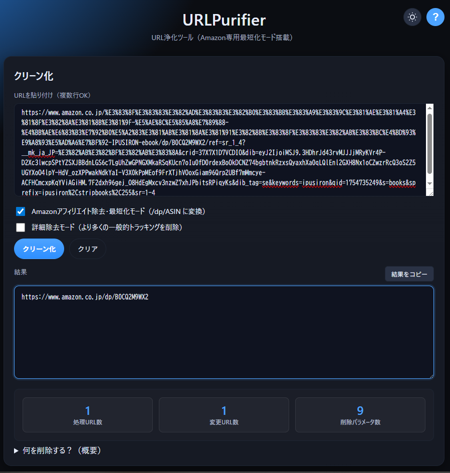

# URLPurifier - URL浄化ツール


[](https://ipusiron.github.io/urlpurifier/)

**Day039 - 生成AIで作るセキュリティツール100**

---

## 📝 はじめに

SNSやブログで誰かにAmazonやニュースサイトのリンクを共有するとき、  
「やたら長いリンク」「アフィリエイトタグやトラッキング情報がべったり付いているリンク」に出会ったことはありませんか？

**URLPurifier**は、そんな冗長なURLを1クリックで浄化し、**純粋で安全なリンクだけ**を残すことにこだわったWebツールです。

---

## 🌐 デモページ

👉 [https://ipusiron.github.io/urlpurifier/](https://ipusiron.github.io/urlpurifier/)

---

## 📸 スクリーンショット

>   
>
> *Amazonリンクの浄化例*

---

## 🎯 本ツールの狙い・想定シーン

- SNSやチャットで「見栄えのよいリンク」を共有したい
- Amazonアフィリエイトリンクを一発で正規商品URLに直したい
- コミュニティで「トラッキングなしリンク」を推奨している
  - Amazonアフィリエイトの規約上、クローズドな場（Discordサーバー内、LINEのオープンチャット内、DM内）でのアフィリエイトリンクは違反扱いになっている。そのためクローズドな場にリンクを貼る場合は、URLをクリーン化するのが好ましい。
- URLに付随する`utm_*`や`ref`などの“追跡要素”を排除したい
- セキュリティ啓発やプライバシー教育の教材として活用したい

---

## 🚀 特徴・仕様

- **主要なトラッキングパラメーターの自動除去**
  - `utm_source`, `utm_medium`, `utm_campaign`, `fbclid`, `gclid` ほか多数
- **Amazon専用最短化モード**
  - アフィリエイトタグ(`tag=`)や`ref=`を削除し、`/dp/ASIN`形式に変換
- **詳細除去モード（オプション）**
  - 通常モードでは削除しない、より幅広いトラッキングパラメーターを追加削除
  - SNS系（TikTok、Twitter、LinkedIn）、広告キャンペーン系、参照元系など
  - 詳細は下記「詳細除去モードとは」セクションを参照
- **複数URL同時処理＆一括コピー**
- **ライト/ダークテーマ切り替え**
  - ユーザーの好みに応じてテーマを切り替え可能、設定は自動保存
- **URLプレビュー機能**
  - 長いURLの入力時にリアルタイムでプレビューを表示
- **統計表示機能**
  - 処理後に削除されたパラメーター数や変更URL数を表示
- **充実したヘルプモーダル**
  - 機能説明、削除パラメーター一覧、プライバシー情報を内蔵
- **完全クライアントサイド動作**
  - URLは外部送信されず、ブラウザー内で処理完結
- **軽量でシンプルなUI**
  - 初心者でも迷わず操作可能、レスポンシブ対応

---

## ⚙️ 使い方

1. 変換したいURLをテキストエリアに入力（複数行OK）
2. 必要に応じてオプションを選択：
   - 「Amazonアフィリエイト除去・最短化モード」：Amazon URLを`/dp/ASIN`形式に変換
   - 「詳細除去モード」：より多くのトラッキングパラメーターを削除
3. 「クリーン化」ボタンを押す
4. 処理統計を確認し、出力結果をコピーして利用
5. 右上の「?」ボタンで詳細ヘルプを参照可能

### 追加機能
- **テーマ切り替え**: 右上のアイコンでライト/ダークテーマを切り替え
- **URLプレビュー**: 入力フィールドにフォーカス時、長いURLのプレビューを表示
- **統計表示**: 処理後に削除パラメーター数や変更URL数を表示
- **ヘルプモーダル**: 「?」ボタンから詳細な使い方と削除対象を確認

> 📌 **TIP:** このツールはすべてブラウザー内で処理され、サーバーへの送信は一切行いません。

---

## 🔍 詳細除去モードとは？

「詳細除去モード」は、通常モードよりも積極的にパラメーターを削除するオプション機能です。

### 通常モードで削除されるもの（常に削除）
- **Google系**: `utm_source`, `utm_medium`, `utm_campaign`, `utm_term`, `utm_content`
- **主要広告系**: `fbclid` (Facebook), `gclid` (Google Ads), `dclid` (DoubleClick), `msclkid` (Microsoft)
- **メール配信系**: `mc_cid`, `mc_eid` (Mailchimp), `_hsenc`, `_hsmi` (HubSpot)
- **その他**: `igshid` (Instagram), `spm` (Alibaba), `scid`, `yclid` (Yahoo), `gbraid`, `wbraid`

### 詳細除去モードで追加削除されるもの
- **SNS広告系**: 
  - `ttclid` (TikTok広告)
  - `twclid` (Twitter広告)
  - `li_fat_id` (LinkedIn広告)
- **キャンペーン系**: 
  - `campaign`, `camp` (汎用キャンペーン)
  - `adgroup`, `adid` (広告グループID)
  - `creative` (クリエイティブID)
  - `ef_id` (効果測定ID)
  - `cmpid` (キャンペーンID)
- **参照元系**: 
  - `ref_src`, `ref_url` (参照元URL)
  - これらは機能的に必要な場合もあるため、通常モードでは削除しません

### いつ使うべき？
- **通常モード推奨**: 一般的な用途、機能を壊したくない場合
- **詳細除去モード推奨**: プライバシー重視、完全にクリーンなURLが必要、内部的なキャンペーンパラメーターも削除したい場合

---

## 🛡️ 浄化されていないURLのセキュリティリスク

URLに含まれるトラッキングパラメーターや不正なパラメーターは、以下のようなセキュリティリスクやプライバシー侵害を引き起こす可能性があります。

### プライバシーリスク
- **行動追跡**: `utm_*`、`fbclid`、`gclid`等により、ユーザーの閲覧履歴や行動パターンが追跡される
- **クロスサイトトラッキング**: 複数のサイト間でユーザーの行動が関連付けられる
- **個人識別**: 特定のパラメーターにより、匿名性が失われ個人が特定される可能性
- **データ収集**: メール配信やMA（マーケティングオートメーション）系パラメーターにより、詳細な行動データが収集される

### セキュリティリスク
- **セッションハイジャック**: セッションIDが含まれたURLを共有することで、他者によるアカウント乗っ取りのリスク
- **認証情報漏洩**: トークンやAPIキーがURLパラメーターに含まれている場合の情報漏洩
- **リファラー漏洩**: URLに含まれる機密情報が、他のサイトのアクセスログに記録される
- **フィッシング攻撃**: 正規URLに似せた悪意のあるパラメーターによる詐欺サイトへの誘導

### ビジネス・法的リスク
- **競合他社への情報提供**: キャンペーン情報や戦略が競合に知られるリスク
- **コンプライアンス違反**: GDPR、個人情報保護法等のプライバシー規制への抵触
- **アフィリエイト規約違反**: 適切でない場所でのアフィリエイトリンク使用による規約違反
- **ブランド毀損**: トラッキングまみれのURLが企業の技術力やプライバシー意識の低さを印象付ける

### 実際の危険な例
```
# セッション情報が漏洩する危険なURL例
https://example.com/dashboard?sessionid=abc123&userid=12345

# 個人を特定可能な情報が含まれるURL例  
https://shop.com/item?customer_id=98765&email=user@example.com

# 内部システムの情報が含まれるURL例
https://site.com/page?debug=true&admin=1&internal_ref=SECRET123
```

### URLPurifierによる対策効果
- **プライバシー保護**: 不要なトラッキングパラメーターを除去し、匿名性を向上
- **情報漏洩防止**: 機密情報を含む可能性のあるパラメーターを事前に除去
- **クリーンな共有**: 安全で見やすいURLでの情報共有を実現
- **コンプライアンス支援**: プライバシー規制への準拠を支援

---

## 💡 開発の背景・こだわりポイント

- **なぜ作ったか？**  
  URLを短くするだけで情報共有の印象が大きく改善されることを、多くの場面で体感したためです。
- **既存ツールの不満点を解消**
  - 重い、広告が多い、日本語対応が不十分、Amazon最短化が別ツール…  
    そんな不満をまとめて解消しました。
- **教育用途も意識**
  - 余計なパラメーターが何のために付いているのかを学び、URLの構造理解を深められます。

---

## 🏷️ ツール名の由来

**URLPurifier**（ユアールエル・ピュリファイア）は、「浄化する」「純化する」を意味する"Purify"に由来します。  
URLから不要な追跡情報やアフィリエイトタグを取り除き、**ピュアな形**に戻すという目的を表しています。  

TrimURLやURLTrimmerなどの候補もありましたが、「純化」のニュアンスをもっとも的確に表すこの名前を採用しました。

---

## 📂 ディレクトリー構成

```
urlpurifier/
├── index.html      # メインHTML（UI構造、ヘルプモーダル含む）
├── script.js       # URL浄化ロジック、UI制御、テーマ切り替え
├── style.css       # ダーク/ライトテーマ、レスポンシブ対応
├── README.md       # プロジェクト説明書
├── CLAUDE.md       # 開発者向けプロジェクト情報
├── LICENSE         # MITライセンス
└── .nojekyll       # GitHub Pages用設定
```

---

## 🛠 技術仕様

### 使用技術
- **フロントエンド**: HTML5, CSS3, JavaScript（Vanilla）
- **UI/UX**: ダーク/ライトテーマ、レスポンシブデザイン
- **ストレージ**: LocalStorage（テーマ設定のみ）

### 実装技術詳細
- **URL解析**: JavaScript URL API による厳密なURL解析
- **パラメーター削除**: 正規表現と前方一致による効率的な検出・削除
- **Amazon最短化**: ASIN抽出アルゴリズム（複数パターン対応）
- **UI制御**: モーダル、トースト、テーマ切り替え、プレビュー機能
- **統計表示**: リアルタイム処理結果の可視化

### 対応URL形式
- HTTP/HTTPS URL
- スキーマなしURL（自動でhttps://付与）
- Amazon各国ドメイン（.com, .co.jp, .co.uk等）
- 複数行バッチ処理対応

---

## 📄 ライセンス

MIT License - 詳細は [LICENSE](LICENSE) をご覧ください。

---

## 🛠 このツールについて

本ツールは、「生成AIで作るセキュリティツール100」プロジェクトの一環として開発されました。  
このプロジェクトでは、AIの支援を活用しながら、セキュリティに関連するさまざまなツールを100日間にわたり制作・公開していく取り組みを行っています。

プロジェクトの詳細や他のツールについては、以下のページをご覧ください。

🔗 [https://akademeia.info/?page_id=42163](https://akademeia.info/?page_id=42163)
