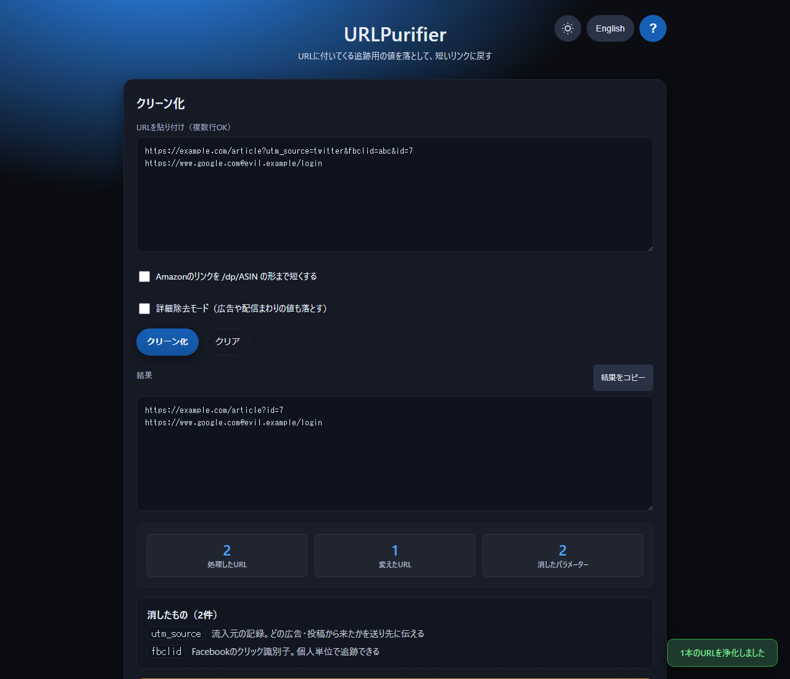
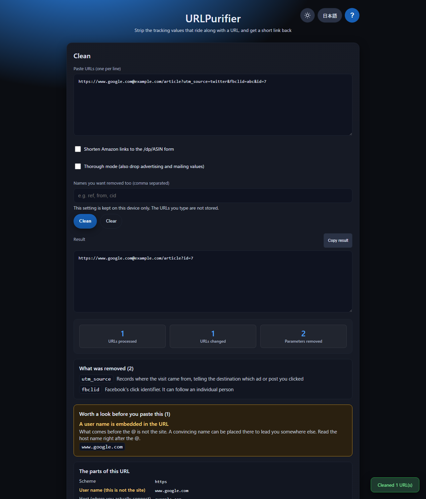

<!--
---
id: day039
slug: urlpurifier

title: "URLPurifier"

subtitle_ja: "URL浄化ツール"
subtitle_en: "URL Cleaning Tool"

description_ja: "URLに含まれるトラッキングパラメーターやアフィリエイトタグを除去し、純粋でクリーンなリンクを生成するクライアントサイドWebツール。Amazon専用最短化モード搭載。"
description_en: "A client-side web tool that removes tracking parameters and affiliate tags from URLs to generate clean, privacy-friendly links. Features Amazon URL shortening mode."

category_ja:
  - プライバシー
  - Webセキュリティ
category_en:
  - Privacy
  - Web Security

difficulty: 1

tags:
  - URL
  - tracking
  - privacy
  - affiliate
  - Amazon
  - client-side

repo_url: "https://github.com/ipusiron/urlpurifier"
demo_url: "https://ipusiron.github.io/urlpurifier/"

hub: true
---
-->
# URLPurifier - URL浄化ツール

[English](README.en.md) · 日本語


[](https://ipusiron.github.io/urlpurifier/)

**Day039 - 生成AIで作るセキュリティツール100**

**URLPurifier** は、URLに付いてくる追跡用の値を落として、短いリンクに戻すツールです。

消すだけでは終わりません。**何を消したのか、その値が何を伝えていたのか**を並べて見せます。あわせて、消す対象ではないものの、貼る前に見ておきたい点も指摘します。

ブラウザーだけで動きます。入力したURLはどこへも送らず、保存もしません。

## 🔗 デモページ

👉 **[https://ipusiron.github.io/urlpurifier/](https://ipusiron.github.io/urlpurifier/)**

## 📸 スクリーンショット



*消した値と、その値が何を伝えていたかを並べる*



*英語表示。同じ内容を英語で出す*

## 🎯 何ができるか

### 追跡用の値を落とす

- 共通：`utm_*`（流入元）、`fbclid`、`gclid`、`dclid`、`msclkid`、`yclid`、`mc_cid`、`_hsenc`、`igshid`、`spm` など
- サイト別：YouTubeの`si`・`feature`、Xの`t`・`s`、Instagramの`igsh`、Spotifyの`si`、TikTokの`is_from_webapp`、Facebookの`mibextid`
- 詳細除去モード：`ttclid`、`twclid`、`li_fat_id`、`campaign`、`adgroup`、`ref_src` など
- Amazonモード：`tag`・`ref`・`psc`・`keywords` などを落とし、`/dp/ASIN` の形へそろえる
- ＃以降：`#utm_source=` のような値と、読んでいた位置が残る `#:~:text=`

複数行をまとめて処理できます。`Ctrl+Enter`でも実行できます。

### 消さないものは残す

消すと意味が変わる値は残します。検索語、記事の番号、ページ番号、YouTubeの再生位置などです。

**同じ名前でも、サイトが違えば扱いを変えます。**たとえば`t=`はXでは共有元をたどる値なので落としますが、YouTubeでは再生位置なので残します。関係のないサイトでは触りません。

### 何を消したかを見せる

消した値の名前と、その値が何を伝えていたかを並べます。

```
消したもの（3件）
  utm_source  流入元の記録。どの広告・投稿から来たかを送り先に伝える
  utm_medium  流入元の記録。…
  fbclid      Facebookのクリック識別子。個人単位で追跡できる
```

### 貼る前に見ておきたい点を指摘する

消す対象ではないけれど、知らないと損をするものを挙げます。

| 指摘 | 何が起きているか |
|---|---|
| URLに利用者名が埋め込まれている | `https://www.google.com@evil.example/` の`@`の前はサイト名ではない |
| ラテン文字に見せかけたホスト名 | キリル文字などで`apple`に似せる手口。日本語ドメインのように、その言語の文字を正しく使うものは指摘しない |
| ふつうと違うポート番号 | 80と443以外が指定されている |
| 暗号化されていない通信 | `http://`のまま |
| 短縮URL | 行き先が見えない。このツールは展開しない |
| 別のURLを連れている | パラメーターの中に別のURLが入っている（踏み台にされる手口）。**行き先を取り出して見せ、その行き先自体の問題も1段だけ見る** |
| 共有する前に外したいパラメーター | `email=`・`token=`・`session=` など、連絡先や認証に関わる名前 |
| 値そのものが見られると困る形 | メールアドレス・JWT・長い乱数のような値 |

## 🌐 日本語と英語

画面右上のボタンで切り替えます。言語は次の順で決まります。

1. URLの `?lang=ja` または `?lang=en`
2. 前回選んだ設定
3. ブラウザーの言語設定

切り替えるとページを読み込み直しますが、**入力中のURLと結果はそのまま残ります**。持ち越しには`window.name`を使っており、ストレージは使いません。

なお、**画面の設定（テーマと言語）だけはこの端末に保存します。**入力したURLは保存しません。保存を拒否するブラウザーでも、設定が戻らないだけで、機能はすべて動きます。

## 🔐 このツール自身の安全性

URLを扱うツールが、扱ったURLで壊れては話になりません。

- **`http`と`https`以外は浄化しません。**`javascript:`や`data:`は、貼った先で動く危険があるため出力しません
- URLでない文字列から、実在しないURLを作りません
- 利用者の入力をHTML文字列へ組み立てません。表示はすべて`textContent`と`createElement`で行います
- インラインの`onclick`と`style`属性を使いません
- CSPで`unsafe-inline`も`unsafe-eval`も許可しません
- 外部のCDN・フォント・APIを一切読み込みません

指定しているCSPは次のとおりです。

```
default-src 'none'; script-src 'self'; style-src 'self';
img-src 'self' data:; font-src 'self'; connect-src 'none';
base-uri 'self'; form-action 'self'; object-src 'none';
```

**meta要素のCSPでは`frame-ancestors`が効きません。**静的ホスティングでは任意のHTTPヘッダーを付けられないため、クリックジャッキングへの備えは入っていません。埋め込みの制御が必要な場面では、サーバー側でヘッダーを返す必要があります。

## 🧪 テスト

依存パッケージはありません。Node.js 22以降で動きます。

```bash
npm test
```

49件のテストがあり、次を確かめます。

- `javascript:`などのスキームを出力しないこと、偽のURLを作らないこと
- サイト別ルールが、そのサイトでだけ効くこと
- 意味のある値（検索語・再生位置）を残すこと
- 消した値と説明の対応が付いていること
- 危険サインを挙げること、ふつうのURLには出さないこと
- CSP・`style`属性・インラインハンドラー・外部通信を持ち込まないこと
- ダイアログの組み立てとフォーカスの扱い
- 日本語と英語の辞書のキーが一致し、空の値と差し込みの食い違いがないこと
- 画面の文言を`script.js`へ直接書いていないこと
- READMEのYAML・見出し構造・ディレクトリー構成・テスト件数が実態と合っていること

`.github/workflows/test.yml` が、pushとpull requestのたびに同じテストを実行します。

## 📂 ディレクトリー構成

```
urlpurifier/
├── index.html                # 画面の骨組み。文言は data-i18n で辞書と結ぶ
├── style.css                 # スタイル（ライト／ダーク、狭い画面に対応）
├── i18n.js                   # 日英の辞書と、言語の判定・切り替え
├── script.js                 # URLの解釈、除去ルール、危険サインの判定、画面の更新
├── test/
│   ├── helper.js             # Nodeから素のスクリプトを読むための足場
│   ├── url-safety.test.js    # スキームの許可リストとURL判定
│   ├── features.test.js      # サイト別ルール・内訳・危険サイン
│   ├── markup.test.js        # CSP・マークアップ・アクセシビリティ
│   ├── i18n.test.js          # 日英の辞書と文言の集約
│   ├── idn.test.js           # punycodeのデコードと、見せかけホスト名の判定
│   ├── sensitive.test.js     # 共有前に外したい値と、連れているURLの行き先
│   └── docs.test.js          # READMEの整合
├── .github/workflows/test.yml # pushとpull requestでテストを実行
├── package.json              # node --test を呼ぶだけ。依存なし
├── CLAUDE.md                 # このリポジトリーで作業するときの前提
├── README.md                 # この文書
├── README.en.md              # 英語版
├── LICENSE                   # MITライセンス
└── assets/
    ├── screenshot.png        # 日本語画面のスクリーンショット
    └── en/
        └── screenshot.png    # 英語画面のスクリーンショット
```

## ⚙️ 動作環境

- モダンブラウザー（Chrome・Edge・Firefox・Safariの最近の版）
- ビルドは不要。`index.html`をそのまま開いても、ローカルのHTTPサーバー経由でも動く
- テストの実行にはNode.js 22以降が必要（ツール自体の利用には不要）

## 🏷️ ツール名の由来

**URLPurifier**（ユアールエル・ピュリファイア）は、「浄化する」「純化する」を意味する"Purify"に由来します。URLから不要な追跡情報やアフィリエイトタグを取り除き、**ピュアな形**に戻すという目的を表しています。

TrimURLやURLTrimmerなどの候補もありましたが、「純化」のニュアンスを最も的確に表すこの名前を採用しました。

## 📄 ライセンス

MIT License - 詳細は [LICENSE](LICENSE) をご覧ください。

## 🛠 このツールについて

本ツールは、「生成AIで作るセキュリティツール100」プロジェクトの一環として開発されました。このプロジェクトでは、AIの支援を活用しながら、セキュリティに関連するさまざまなツールを100日間にわたり制作・公開していく取り組みを行っています。

プロジェクトの詳細や他のツールについては、以下のページをご覧ください。

🔗 [https://akademeia.info/?page_id=42163](https://akademeia.info/?page_id=42163)
